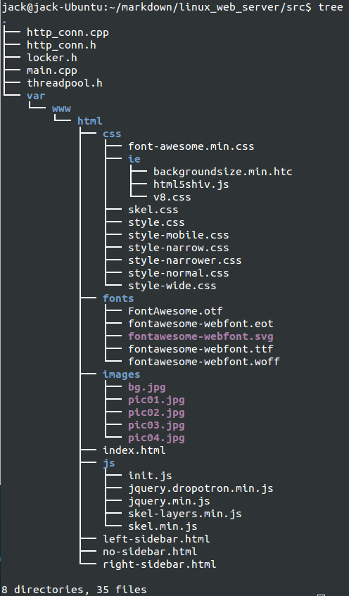

## Simple Http Server ##

一个简单的web服务器,目前只支持http协议中的get操作,代码主体框架来自游双大神的<<Linux高性能服务器编程>>第15章线程池服务器内容,仅供学习交流关于C++后台编程知识.下面将介绍如何使用这个代码.这里的测试环境是Ubuntu 14.04,其他版本理论也可以.

首先你得下载该代码到本地目录,然后解压,进入代码目录,代码目录内容如下:

除去var目录里面的内容都是工程代码,var/www/html目录以下内容是用来测试服务器的静态页面代码,从该网站下载到 http://www.cssmoban.com/cssthemes/7798.shtml 

可以编译运行该部分代码:

	g++ main.cpp http_conn.cpp locker.h -o app -lpthread

然后运行该代码:

	./app 127.0.0.1 8034

这里的IP和端口可以自己设置,如果没有报错,那么可以打开浏览器,输入 http://127.0.0.1:8034/index.html ,你将可以看到该页面:

